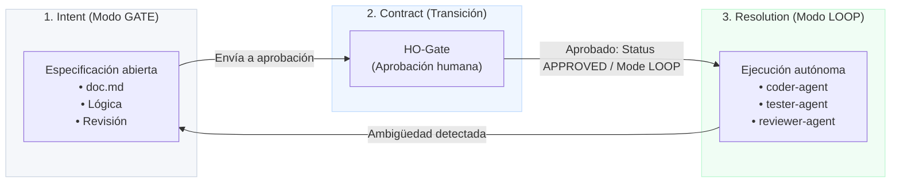

# SDD-GL — Desarrollo Guiado por Especificaciones: Gate/Loop

[](CHANGELOG.md)
[](LICENSE)
[](https://docs.claude.ai/code)
[](#3-configuración-del-stack-recomendado)

> *La especificación no es documentación: es el contrato de completitud.*

SDD-GL es un plugin para Claude Code que implementa un proceso de desarrollo guiado por especificaciones (Spec-Driven Development), diseñado específicamente para **un solo desarrollador**. Resuelve un problema fundamental: al trabajar en solitario con IA, no es práctico revisar cada microiteración, pero tampoco se puede ceder el control total en las decisiones de diseño.

La solución consiste en un flujo de trabajo que determina cuándo se requiere intervención humana y cuándo no.

---

## ¿Por qué SDD-GL?

Las herramientas de SDD tradicionales (como AIUP, Kiro o BMad) están diseñadas para equipos con múltiples roles: revisores, interesados (stakeholders) y varios encargados de validar cada fase. Para un desarrollador independiente, este modelo genera una fricción innecesaria al exigir su presencia constante en decisiones menores que la IA podría resolver autónomamente.

El extremo opuesto es igualmente problemático: ceder el control por completo genera código que no ha sido contrastado con ninguna especificación, perdiendo toda trazabilidad cuando ocurre un error.

**SDD-GL resuelve esta tensión mediante una distinción clara:**

- **Gate**: Si la especificación tiene decisiones de diseño pendientes, el proceso se detiene y espera la intervención humana.
- **Loop**: Una vez que la especificación está cerrada y aprobada, el proceso se ejecuta de manera autónoma hasta su finalización.

No se trata de "revisar absolutamente todo" ni de "otorgar autonomía ilimitada a la IA". Es gobernanza selectiva: la intervención humana ocurre exactamente cuando su criterio técnico aporta valor.


---

## Conceptos clave

### Las tres capas



* **Intent (Intención)**: Fase donde se construye la especificación. El `requirements-agent` y el `reviewer-agent` refinan el contrato sección por sección. En esta etapa nunca se genera código de la aplicación. El desarrollador revisa y valida el diseño antes de avanzar.
* **Contract (HO-Gate - Transición)**: El acto formal de aprobación humana. No consiste en una casilla de verificación automática; es el instante en el que el desarrollador valida que la especificación está completa, es consistente y resulta ejecutable. Este gesto inicia la ejecución del bucle autónomo.
* **Resolution (Resolución)**: Fase en la que los agentes trabajan de manera autónoma. El Loop infiere los criterios de finalización a partir del contrato y no se detiene hasta cubrirlos por completo. Si detecta algún aspecto no definido en la especificación, no realiza suposiciones: regresa a la fase de Gate y solicita definición.

---

### Los dos modos


> [!IMPORTANT]
> **¿Por qué el paso Gate no se aprueba automáticamente?**
> Porque la especificación requiere decisiones conceptuales y de negocio que la IA no debe tomar por sí sola (por ejemplo: definir si un valor de cero es válido o determinar si una cuenta de destino puede ser de otro usuario). Estas decisiones exigen juicio humano. El **HO-Gate** (Human Approval Gate) es el mecanismo de control que previene que las ambigüedades de diseño se trasladen de forma inadvertida al código fuente.

> [!NOTE]
> **¿Por qué el Loop no solicita autorizaciones intermedias?**
> Una vez que la especificación está definida y cerrada de forma consistente, requerir confirmaciones adicionales para escribir pruebas o implementar lógica introduce demoras innecesarias. El Loop opera con la autonomía exacta definida en la especificación: si encuentra una ambigüedad, escala inmediatamente; si el escenario está contemplado, lo implementa autónomamente.

---

### El Completion Map (Mapa de Completitud)

Cuando el desarrollador aprueba el contrato, el Loop procesa la especificación e infiere los criterios de finalización de forma automática, sin requerir configuración manual por parte del usuario.

```markdown
COMPLETION MAP: FEAT-0001
# generado: 2026-08-03 10:30
# Flujo Principal | integration-test:FEAT-0001-main  | coder+tester | ❌
# AF-01           | unit-test:FEAT-0001-af01          | tester       | ❌
# AF-02           | unit-test:FEAT-0001-af02          | tester       | ❌
# BR-001          | unit-test:FEAT-0001-br001         | tester       | ❌
# BR-002          | unit-test:FEAT-0001-br002         | tester       | ❌
# AC-001          | assertion:FEAT-0001-ac001         | tester       | ❌
# AC-002          | assertion:FEAT-0001-ac002         | tester       | ❌
```

#### Tabla de Inferencia de Criterios

| Elemento en el Contract | Criterio inferido |
| :--- | :--- |
| Flujo Principal (N pasos) | Mínimo 1 prueba de integración |
| Flujo Alternativo (AF-XX) | 1 prueba unitaria por cada AF |
| Regla de Negocio (BR-XXX) | 1 prueba unitaria de validación por cada BR |
| Criterio de Aceptación (AC-XXX) | Mínimo 1 aserción verificable por cada AC |

> [!TIP]
> El Loop no finaliza su ejecución hasta que todos los elementos marcados en el Completion Map se resuelvan satisfactoriamente (`✅`). La cobertura de pruebas no está determinada por un porcentaje genérico, sino directamente por los requisitos especificados en el contrato.

---

## Inicio Rápido (Quickstart)

Sigue esta guía paso a paso para configurar y comenzar a utilizar SDD-GL en tu entorno local.

### 1. Requisitos Previos
- **Claude Code** (versión `>= 1.0.0`) o el CLI de **Antigravity**.
- Un proyecto de desarrollo controlado bajo un repositorio de **Git**.
- Configuración básica de testing en el proyecto (el bucle autónomo requiere ejecutar pruebas automatizadas).

### 2. Instalación de SDD-GL
Elige uno de los siguientes métodos para incorporar el plugin en tu proyecto:

#### Opción A: Clonación directa en el proyecto (Instalación limpia)
Ejecuta los siguientes comandos desde la raíz de tu proyecto para incorporar los archivos necesarios:
```bash
git clone https://github.com/CharlyZeta/sdd-gl .sdd-gl
cp .sdd-gl/CLAUDE.md .
cp -r .sdd-gl/protocol .
cp -r .sdd-gl/.claude .
mkdir -p contracts
rm -rf .sdd-gl
```

#### Opción B: Submódulo de Git (Recomendado para actualizaciones)
Si deseas vincular el repositorio para recibir actualizaciones fácilmente:
```bash
git submodule add https://github.com/CharlyZeta/sdd-gl .sdd-gl
cp .sdd-gl/CLAUDE.md .
cp -r .sdd-gl/protocol .
cp -r .sdd-gl/.claude .
mkdir -p contracts
```

### 3. Configuración del Stack (Recomendado)
Crea un archivo llamado `stack.md` en el directorio raíz para que los agentes comprendan tus tecnologías y sigan las pautas arquitectónicas del proyecto:
```markdown
# Stack de Desarrollo
- Lenguaje: Java 21
- Framework: Spring Boot 3.x
- Base de Datos: PostgreSQL
- Pruebas: JUnit 5 + Mockito
- Herramienta de Construcción: Maven
- Estilo Arquitectónico: Arquitectura Hexagonal + DDD
```
> [!NOTE]
> Sin `stack.md`, los agentes continuarán funcionando, pero generarán código y pruebas genéricas sin apegarse a las convenciones de tu proyecto.

---

## Guía de Uso

### Iniciar una nueva Funcionalidad (Feature)
Para iniciar el diseño e implementación de una nueva funcionalidad, ejecuta:
```bash
/sdd-feature "registrar un pago entre dos cuentas"
```
El proceso generará un contrato en borrador (`DRAFT`) e iniciará la fase **Gate**:
```
✅ Contract creado: contracts/FEAT-0001.md

📋 Revisá y completá antes de aprobar:
   - [ ] Business Rules (BR-XXX como invariante verificable)
   - [ ] Acceptance Criteria (AC-XXX en formato GIVEN/WHEN/THEN)
   - [ ] Alternative Flows si aplica

   ⏸️  Cuando estés listo: cambiá Status: APPROVED y Mode: LOOP
```
El agente `requirements-agent` te ayudará a estructurar las secciones necesarias, y el `reviewer-agent` comprobará la coherencia del diseño antes de dar paso a la aprobación.

### Iniciar una Corrección (Bugfix)
Para resolver un fallo en el sistema con un Gate simplificado que no requiere el modelado completo de casos de uso:
```bash
/sdd-fix "el saldo no se actualiza cuando el pago falla a mitad"
```
Solo necesitarás definir los siguientes datos básicos en la especificación del bugfix:
```markdown
## Pasos de Reproducción
1. Iniciar pago por 500 ARS.
2. Simular un fallo en el paso de acreditación.
3. Verificar el saldo de la cuenta origen.

## Comportamiento Actual
El saldo de origen se debita a pesar de que la transacción falló.

## Comportamiento Esperado
El saldo no debe verse alterado si el pago no se completa con éxito.

## Criterios de Aceptación
- AC-001: GIVEN pago iniciado WHEN falla la acreditación
          THEN el saldo origen no cambia y el pago queda en FAILED.
```

### Consultar el Estado del Proyecto
Para visualizar un resumen del estado de todas las especificaciones y el progreso del Loop, ejecuta:
```bash
/sdd-status
```
El sistema devolverá una vista detallada:
```
📊 SDD-GL Status

🔴 DRAFT (Gate — esperando revisión)
   └── FEAT-0003: Alta de usuario con verificación de email

🟡 APPROVED (Loop en progreso)
   └── FEAT-0002: Transferencia internacional [8/11 ✅]

🟢 RESOLVED
   └── FEAT-0001: Registrar pago entre cuentas [12/12 ✅]
   └── FIX-0001: Fix rollback de saldo en pago fallido [4/4 ✅]

Total: 4 contracts | 1 en Gate | 1 en Loop | 2 resueltos
```

---

## Ejemplo de Contrato Completo

A continuación se presenta una especificación real (`Contract`) tras superar la fase de validación de **Gate** y justo antes de pasar al **Loop** autónomo de desarrollo:

```markdown
# CONTRACT: Registrar un pago entre dos cuentas
# ID: FEAT-0001
# Status: APPROVED
# Mode: LOOP

## Intent
Permitir que un usuario registre un pago desde una cuenta origen
hacia una cuenta destino, debitando y acreditando los saldos correspondientes.

## Use Case
**Actor:** Usuario autenticado
**Goal:** Registrar un pago entre dos cuentas

### Main Flow
1. El usuario selecciona cuenta origen y cuenta destino
2. El usuario ingresa el monto del pago
3. El sistema registra el pago y actualiza los saldos

### Alternative Flows
- AF-01: Saldo insuficiente → error INSUFFICIENT_FUNDS sin modificar saldos
- AF-02: Cuenta origen = cuenta destino → error SAME_ACCOUNT_NOT_ALLOWED
- AF-03: Cuenta no pertenece al usuario → error ACCOUNT_NOT_FOUND

## Business Rules
- BR-001: El monto del pago debe ser mayor a cero
- BR-002: La cuenta origen debe tener saldo suficiente para cubrir el monto
- BR-003: La cuenta origen y destino no pueden ser la misma
- BR-004: La cuenta origen debe pertenecer al usuario autenticado
- BR-005: El estado inicial de todo pago registrado es PENDING

## Acceptance Criteria
- AC-001: GIVEN cuenta origen con saldo 1000 y cuenta destino distinta
          WHEN el usuario registra un pago de 200
          THEN saldo origen queda en 800, saldo destino suma 200,
               pago en estado COMPLETED
- AC-002: GIVEN cuenta origen con saldo 100
          WHEN el usuario intenta registrar un pago de 500
          THEN el sistema rechaza con INSUFFICIENT_FUNDS y ningún saldo cambia
- AC-003: GIVEN el usuario selecciona la misma cuenta como origen y destino
          WHEN intenta registrar el pago
          THEN el sistema rechaza con SAME_ACCOUNT_NOT_ALLOWED

## Entities Affected
- Payment: monto, cuentaOrigen, cuentaDestino, fecha, estado
- Account: saldo

## Ambiguity Log
- [x] BR-004: RESUELTO — cuenta destino puede pertenecer a cualquier usuario

## Completion Map
# generated: 2026-08-03 10:30
# Main Flow | integration-test:FEAT-0001-main  | coder+tester | ❌
# AF-01     | unit-test:FEAT-0001-af01          | tester       | ❌
# AF-02     | unit-test:FEAT-0001-af02          | tester       | ❌
# AF-03     | unit-test:FEAT-0001-af03          | tester       | ❌
# BR-001    | unit-test:FEAT-0001-br001         | tester       | ❌
# BR-002    | unit-test:FEAT-0001-br002         | tester       | ❌
# BR-003    | unit-test:FEAT-0001-br003         | tester       | ❌
# BR-004    | unit-test:FEAT-0001-br004         | tester       | ❌
# BR-005    | unit-test:FEAT-0001-br005         | tester       | ❌
# AC-001    | assertion:FEAT-0001-ac001         | tester       | ❌
# AC-002    | assertion:FEAT-0001-ac002         | tester       | ❌
# AC-003    | assertion:FEAT-0001-ac003         | tester       | ❌
```

---

## Los Cuatro Agentes

SDD-GL incluye cuatro agentes integrados. No requieren configuración manual; el orquestador se encarga de invocarlos con el contexto adecuado en cada etapa del ciclo.

### `requirements-agent`
Opera exclusivamente durante la fase de **Gate**. Completa las secciones del contrato **una por iteración** para garantizar que no se omitan detalles; nunca avanza más de una sección sin esperar una revisión y validación intermedia. Formatea las reglas de negocio como invariantes lógicas y estructura los criterios de aceptación bajo el estándar GIVEN/WHEN/THEN.
* **Propósito**: Asegurar un diseño progresivo y reflexivo en lugar de una generación apresurada. Permite corregir la dirección del diseño de forma temprana.

### `reviewer-agent`
Opera de manera transversal tanto en **Gate** como en **Loop**.
* En **Gate**, valida la consistencia lógica interna antes de la aprobación humana: detecta contradicciones entre reglas de negocio y criterios de aceptación, referencias a datos inexistentes y criterios no comprobables.
* En **Loop**, analiza los fallos tras tres intentos de compilación o testeo para discernir si se trata de un error de implementación (lo que provoca un reintento) o de una ambigüedad conceptual en el contrato (lo que detiene el flujo y escala a Gate).
* **Propósito**: Prevenir que especificaciones incompatibles o erróneas inicien la fase de codificación, ahorrando ciclos fallidos de desarrollo.

### `coder-agent`
Opera únicamente durante la fase de **Loop**. Es el encargado de escribir el código de la aplicación y de subsanar los fallos de implementación reportados por las pruebas. Analiza el archivo `stack.md` para respetar fielmente las tecnologías y convenciones del proyecto. Si requiere tomar una decisión de diseño que no esté documentada en el contrato, detiene el proceso y escala la decisión al desarrollador.

### `tester-agent`
Opera únicamente durante la fase de **Loop**. Diseña y ejecuta las pruebas necesarias para verificar cada regla de negocio (BR), flujo alternativo (AF) y criterio de aceptación (AC). C## Casos de Uso Críticos y Robustez

El protocolo de SDD-GL está optimizado para lidiar con escenarios complejos del día a día, minimizando la pérdida de tiempo y el retrabajo.

### 1. Detección de Contradicciones en la Fase Gate
Supongamos el siguiente conflicto lógico en la especificación:
```markdown
BR-001: El monto debe ser mayor a cero.
AC-002: GIVEN monto=0 WHEN transfiere THEN el sistema acepta la transacción.
```
* **Comportamiento**: El `reviewer-agent` identifica la inconsistencia de inmediato durante la fase de Gate. El sistema bloquea el cambio de estado a `APPROVED` y presenta al desarrollador las alternativas para corregirlo.
* **Importancia**: Evita la escritura de pruebas destinadas a fallar por incompatibilidad de requisitos, impidiendo que el Loop inicie con un diseño defectuoso.

### 2. Recuperación ante Fallos (Crash Recovery) sin Pérdida de Progreso
Si la ejecución se interrumpe durante la fase de Loop (por ejemplo, debido a fallos de red, límites de llamadas a la API o interrupción de la consola), el estado actual se conserva intacto en el disco mediante el Completion Map:
```markdown
# Main Flow | integration-test:FEAT-0001-main | coder+tester | ✅
# AF-01     | unit-test:FEAT-0001-af01         | tester       | ✅
# AF-02     | unit-test:FEAT-0001-af02         | tester       | ⏳  ← Interrumpido aquí
# BR-001    | unit-test:FEAT-0001-br001        | tester       | ❌
```
* **Comportamiento**: Al reanudar el comando, el Loop lee el archivo del mapa y retoma las tareas en el punto exacto donde se detuvo (`AF-02`). Las tareas completadas (`✅`) no se vuelven a ejecutar.
* **Importancia**: Garantiza la viabilidad del flujo autónomo en proyectos de gran envergadura o con extensas suites de pruebas.

### 3. Resolución Incremental de Ambigüedades
El Loop detiene su ejecución y escala al desarrollador al primer bloqueo irresoluble o falta de definición de diseño que encuentre, en lugar de acumular suposiciones. Cada interacción Gate/Loop mantiene la coherencia histórica del Completion Map:
```
Ciclo 1: Flujo Principal ✅, AFs ✅, BR-001..BR-002 ✅, BR-003 ❌ (Ambigüedad) → Escala a Gate
Ciclo 2: BR-003 ✅, BR-004 ✅, AC-001 ❌ (Ambigüedad) → Escala a Gate
Ciclo 3: AC-001 ✅, AC-002 ✅, AC-003 ✅ → Estado final: RESOLVED
```
* **Importancia**: Resolver las dudas de manera secuencial evita que el código se desvíe de los requisitos del negocio y previene refactorizaciones masivas al final del proceso.

---

## Comparativa con Otras Metodologías

| Criterio / Característica | SDD-GL | AIUP (Martinelli) | Kiro | BMad |
| :--- | :--- | :--- | :--- | :--- |
| **Diseñado para** | 1 Desarrollador (Solo) | Equipos | Equipos | Equipos |
| **Control Humano** | Selectivo (solo en especificación) | En cada fase del ciclo | En cada fase del ciclo | En cada fase del ciclo |
| **Criterios de Aceptación (Done)** | Inferidos automáticamente | Definidos manualmente | Definidos manualmente | Definidos manualmente |
| **Recuperación ante Caídas** | ✅ Sí (Persistencia por ítem) | ❌ No | ❌ No | ❌ No |
| **Contradicciones en Validación** | ✅ Detectada antes de aprobar | ❌ No | Parcial | ❌ No |
| **Múltiples Ambigüedades** | ✅ Ciclos independientes | ❌ No | ❌ No | ❌ No |
| **Compatibilidad Tecnológica** | ✅ Stack-agnostic | Parcial (plugins específicos) | ❌ No | ❌ No |
| **Proyectos Existentes (Brownfield)**| ✅ Soportado (vía `/sdd-fix`) | Limitado | ❌ No | ❌ No |

---

## Recomendaciones de Uso

### Cuándo utilizar `/sdd-feature`
- Desarrollo de nuevas funcionalidades con un dominio de datos no trivial (que involucren más de dos entidades).
- Modificaciones que impacten o redefinan las reglas de negocio preexistentes.
- Escenarios donde se requiera una trazabilidad rigurosa y documentada entre especificaciones y pruebas.

### Cuándo utilizar `/sdd-fix`
- Corrección de fallos (bugs) donde el comportamiento erróneo actual y el esperado estén plenamente identificados.
- Regresiones de software (funcionalidad que previamente operaba de manera correcta).
- Parches críticos o urgentes que se beneficien de un proceso Gate simplificado.

### Cuándo evitar el uso de SDD-GL
- Pruebas de concepto (spikes técnicos) o exploraciones libres de código sin criterios de aceptación iniciales.
- Tareas exclusivas de infraestructura, scripts de despliegue o cambios de configuración que no contengan lógica de negocio.
- Refactorizaciones puras que no alteren el comportamiento externo (puesto que no hay cambios en la especificación).
- Proyectos que no posean una base o suite de pruebas automatizadas (dado que el Loop requiere ejecutar tests para validar la completitud).

### Recomendaciones para Redactar Especificaciones de Calidad
* **Reglas de Negocio (Business Rules)**: Defínelas como invariantes lógicas verificables en lugar de descripciones de comportamiento.
  * ❌ `BR-001: El sistema debe validar el monto antes de procesar.`
  * ✅ `BR-001: El monto de la transacción debe ser mayor a cero.`
* **Criterios de Aceptación (Acceptance Criteria)**: Asegúrate de que las condiciones `GIVEN` reflejen estados reproducibles de datos y no descripciones genéricas.
  * ❌ `AC-001: GIVEN que el usuario tiene saldo suficiente WHEN realiza la transferencia THEN se procesa correctamente.`
  * ✅ `AC-001: GIVEN una cuenta origen con saldo 1000 WHEN transfiere 200 THEN el saldo final de la cuenta origen queda en 800.`
* **Flujos Alternativos (Alternative Flows)**: Especifica claramente el resultado final esperado o el código de error correspondiente, no solo la condición detonante.
  * ❌ `AF-01: Saldo insuficiente.`
  * ✅ `AF-01: Saldo insuficiente → retorna el error INSUFFICIENT_FUNDS sin modificar saldos.`

---

## Alcance y Limitaciones

### Lo que SDD-GL proporciona
- Un marco estructurado de trabajo y protocolo operativo (no incluye ni impone librerías en tu código).
- Orquestación automatizada de agentes para la redacción de especificaciones, desarrollo y generación de pruebas.
- Trazabilidad nativa entre las especificaciones del contrato y los casos de prueba generados.
- Validación temprana de inconsistencias conceptuales antes de la generación de código fuente.
- Persistencia de estados de ejecución para tolerar interrupciones del entorno.

### Lo que SDD-GL no cubre
- No determina ni restringe los lenguajes, frameworks o herramientas de pruebas de tu stack tecnológico.
- No gestiona ni crea recursos de infraestructura (como contenedores de Docker, flujos de CI/CD o migraciones de base de datos).
- No pretende reemplazar herramientas de gestión de proyectos o tableros de incidencias (como Jira, GitHub Issues o Linear).
- No garantiza la idoneidad ni calidad de las pruebas si el contrato de origen posee fallos lógicos o está mal redactado.
- Requiere de un runtime compatible (como Claude Code o Antigravity CLI) para ejecutar los flujos del agente.

### Limitaciones Conocidas (Versión 0.1.0)
* **Inmutabilidad del Mapa de Completitud**: El Completion Map se genera una única vez al transicionar al modo Loop. Si se realizan modificaciones al contrato con el Loop ya iniciado, el mapa no sincronizará dichos cambios de manera automática.
* **Ausencia de Árboles de Dependencias**: No existe soporte directo para modelar dependencias jerárquicas entre especificaciones (por ejemplo, definir que `FEAT-0002` requiere la previa implementación de `FEAT-0001`).
* **Agentes Bundled Genéricos**: Los prompts e instrucciones de los agentes son de propósito general. Para entornos de desarrollo o stacks muy especializados (por ejemplo, jOOQ, Kotlin con Corrutinas o arquitecturas reactivas complejas), se recomienda personalizar los archivos `coder-agent.md` y `tester-agent.md` añadiendo reglas particulares del stack.

---

## Estructura del Repositorio

```
sdd-gl/
├── README.md              ← Documentación principal del plugin.
├── CHANGELOG.md           ← Historial de cambios y versiones del proyecto.
├── plugin.json            ← Archivo de configuración del plugin.
├── CLAUDE.md              ← Instrucciones principales del orquestador (Claude Code).
├── LICENSE                ← Licencia del software (MIT).
├── protocol/
│   ├── contract.md        ← Estructura del contrato ejecutable y reglas de inferencia.
│   ├── gate.md            ← Protocolo de validación y gobernanza con el desarrollador.
│   └── loop.md            ← Mecanismos del bucle autónomo y resiliencia ante fallos.
├── .claude/
│   ├── agents/
│   │   ├── requirements-agent.md   ← Genera y detalla las especificaciones en Gate.
│   │   ├── reviewer-agent.md       ← Valida la consistencia lógica y detecta bloqueos.
│   │   ├── coder-agent.md          ← Implementa el código fuente durante el Loop.
│   │   └── tester-agent.md         ← Desarrolla y ejecuta la batería de pruebas.
│   └── commands/
│       ├── sdd-feature.md          ← Definición para el comando /sdd-feature.
│       ├── sdd-fix.md              ← Definición para el comando /sdd-fix.
│       └── sdd-status.md           ← Definición para el comando /sdd-status.
└── contracts/             ← Directorio de destino para las especificaciones del proyecto.
    └── .gitkeep
```

---

## Plan de Desarrollo (Roadmap)

### Versión 0.2.0 (Próxima)
- [ ] Soporte para árboles de decisión y contratos dependientes (`depends_on: FEAT-XXXX`).
- [ ] Comando `sdd-reopen` para reabrir y modificar especificaciones previamente resueltas (`RESOLVED`).
- [ ] Sincronización automática del Completion Map ante cambios posteriores en el contrato aprobado.
- [ ] Preset tecnológico preconfigurado para Java Spring Boot + PostgreSQL.

### Versión 0.3.0
- [ ] Comando `sdd-review` para generar reportes analíticos de cobertura de todos los contratos.
- [ ] Preset tecnológico para Python (FastAPI).
- [ ] Preset tecnológico para Node.js + TypeScript.

### Backlog de Ideas
- [ ] Integración nativa con sistemas de tickets e incidencias (GitHub Issues, Linear, Jira).
- [ ] Paralelización multiagente para agilizar el procesamiento en contratos con un alto volumen de criterios.
- [ ] Modo de simulación (`dry-run`) para previsualizar el comportamiento del Loop sin escribir código.

---

## Contribuir

SDD-GL se encuentra en una etapa de desarrollo activo y abierto a mejoras. Valoramos especialmente las contribuciones en las siguientes áreas:

1. **Reportes de Casos no Cubiertos**: Si identificas un escenario donde el protocolo de Gate/Loop falle o actúe de manera inconsistente, abre un *issue* describiendo detalladamente el contrato de origen, el comportamiento obtenido y el esperado.
2. **Presets de Stacks**: Diseños de agentes adaptados (`coder-agent.md` y `tester-agent.md`) optimizados para tecnologías concretas.
3. **Evolución del Formato del Contrato**: Propuestas de extensión de la tabla de inferencia para dar soporte a nuevos criterios lógicos en las especificaciones.

Para contribuir, realiza un fork del repositorio, crea una rama temática (feature branch) y envía un *Pull Request* con una descripción clara del caso que resuelve.

---

## Licencia

Este proyecto se distribuye bajo la [Licencia MIT](LICENSE). Consulta el archivo adjunto para más información.

Copyright © 2026 [Gerardo Maidana](https://github.com/CharlyZeta) ([LinkedIn](https://www.linkedin.com/in/gerardomaidana)).

---

*Nota: SDD-GL converge de manera independiente con patrones metodológicos que se están formalizando en el ecosistema de desarrollo moderno (como la iniciativa AIUP de Simon Martinelli). La diferencia fundamental radica en que SDD-GL está optimizado para el desarrollador en solitario, donde un esquema de gobernanza selectiva aporta mayor agilidad que un modelo de aprobación colegiado.*

---

## Integración con Antigravity CLI y Antigravity IDE

SDD-GL cuenta con soporte nativo para **Antigravity CLI** y **Antigravity IDE**, compartiendo exactamente el mismo núcleo metodológico y de protocolo. Únicamente varían las rutas de despliegue y las envolturas (wrappers) de comandos.

### Configuración en Antigravity CLI (`agy`)

#### Instalación Global (Disponible para cualquier proyecto)
Clona el repositorio en la carpeta de extensiones globales de Antigravity:
```bash
git clone https://github.com/CharlyZeta/sdd-gl ~/.gemini/antigravity-cli/plugins/sdd-gl
```
Verifica la correcta carga de comandos listando las habilidades instaladas:
```bash
agy /skills
# Deberías visualizar: sdd-gate, sdd-loop, sdd-feature, sdd-fix y sdd-status.
```

#### Instalación Local (Por proyecto)
Si prefieres integrarlo a nivel del espacio de trabajo:
```bash
mkdir -p .agents/skills
git clone https://github.com/CharlyZeta/sdd-gl /tmp/sdd-gl
cp -r /tmp/sdd-gl/.agents/skills/* .agents/skills/
cp -r /tmp/sdd-gl/protocol .
cp /tmp/sdd-gl/AGENTS.md .
mkdir -p contracts
```

### Integración con Antigravity IDE
Los componentes alojados en el directorio `.agents/skills/` son leídos e incorporados de manera automática por Antigravity IDE al indexar el proyecto. Utiliza la estructura indicada en la instalación local.

### Interacción y Ejecución en Antigravity
El flujo es idéntico a Claude Code. Puedes utilizar comandos explícitos:
```
/sdd-feature "Nueva funcionalidad de pagos"
/sdd-fix "El saldo no se actualiza cuando falla el pago"
/sdd-status
```
Adicionalmente, Antigravity soporta detección de intención mediante lenguaje natural, traduciendo tus peticiones a la habilidad correcta:
* *"Quiero iniciar una nueva funcionalidad para transferencias internacionales"* → Dispara `/sdd-feature`.
* *"El contrato FEAT-0002 ha sido aprobado, inicia la implementación"* → Dispara `/sdd-loop`.

### Equivalencias Técnicas del Entorno

| Aspecto | Claude Code | Entorno Antigravity |
| :--- | :--- | :--- |
| **Orquestador Principal** | `CLAUDE.md` | `AGENTS.md` |
| **Definición de Comandos** | `.claude/commands/*.md` | `.agents/skills/*/SKILL.md` |
| **Definición de Agentes** | `.claude/agents/*.md` | `.agents/skills/*/SKILL.md` |
| **Mapeo de Activación** | `/comando` explícito | Comandos explícitos o detección de lenguaje natural |
| **Modelo Recomendado** | Claude 3.5 Sonnet | Gemini 1.5 Pro / Flash |
| **Protocolo Operativo** | Carpeta `protocol/` (Idéntico) | Carpeta `protocol/` (Idéntico) |
| **Ubicación de Contratos**| Carpeta `contracts/` (Idéntico) | Carpeta `contracts/` (Idéntico) |

El protocolo (Gate/Loop/Contract) es 100% portable. Lo que cambia entre plataformas es solo la capa de integración con el agente, no la lógica del proceso.

