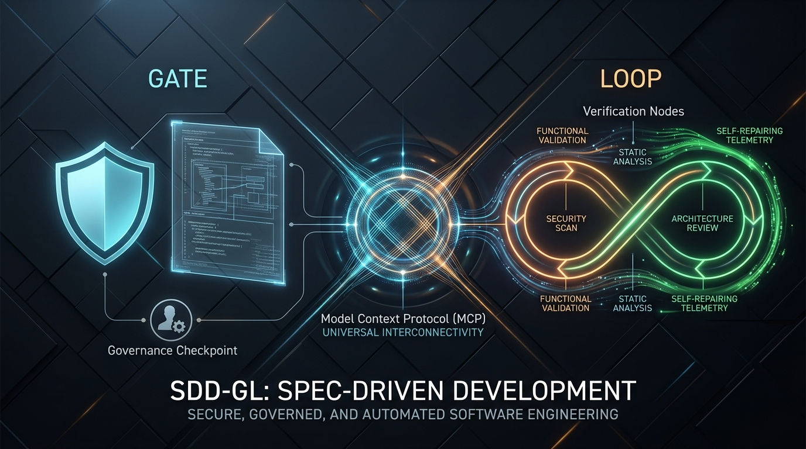
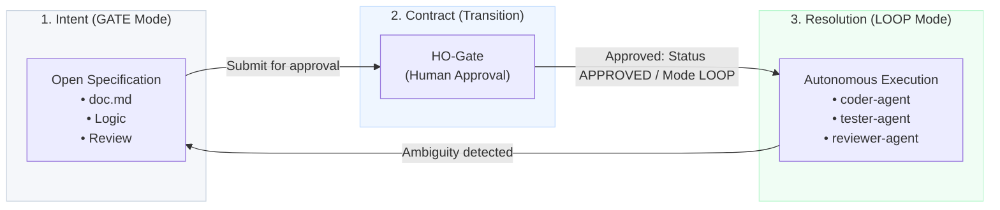
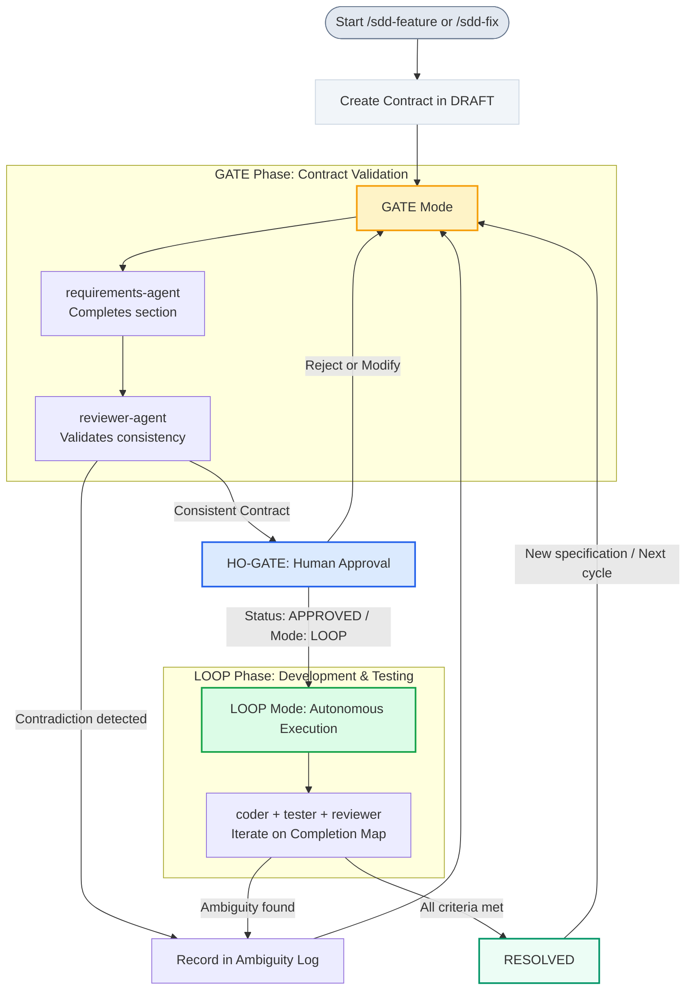

# SDD-GL — Spec-Driven Development: Gate/Loop



[](CHANGELOG.md)
[](LICENSE)
[](mcp/sdd-gl-mcp-spec.md)
[](https://docs.claude.ai/code)
[](#3-recommended-stack-configuration)

[Leer en Español](README.es.md)

> *The specification is not documentation: it is the contract of completeness.*

SDD-GL is a multi-platform framework and Model Context Protocol (MCP) tool that implements a Spec-Driven Development (SDD) process designed specifically for **solo developers**. It provides selective governance across **Claude Code**, **Google Antigravity CLI & IDE**, **Cursor**, **Windsurf**, **VS Code**, and **Zed**. It addresses a fundamental challenge: when working alone with AI, reviewing every single micro-iteration is impractical, yet yielding complete control over design decisions is risky.

The solution is a structured, adaptive workflow that clearly determines when human intervention is required (Gate) and when the AI can operate autonomously with full auditability (Glass Box Loop).

---

## Why SDD-GL?

Traditional SDD methodologies (such as AIUP, Kiro, or BMad) are tailored for teams with multiple roles: reviewers, stakeholders, and separate validators for each phase. For a solo developer, this model creates unnecessary friction by demanding constant human approval for minor decisions that the AI could resolve autonomously.

The opposite extreme is equally problematic: granting absolute autonomy leads to code written without validation against a spec, resulting in lost traceability and high debug costs when issues arise.

**SDD-GL resolves this tension through a clear distinction:**

- **Gate**: If there are unresolved design decisions in the specification, the process pauses and awaits human intervention.
- **Loop**: Once the specification is finalized and approved, the process executes autonomously until completion.

It is neither "reviewing every line of code" nor "granting unlimited autonomy to the AI." Instead, it is selective governance: human intervention occurs precisely when technical judgment delivers the most value.

---

## Key Concepts

### The Three Layers



* **Intent**: The phase where the specification is constructed. The `requirements-agent` and the `reviewer-agent` refine the contract section by section. No application code is generated during this stage. The developer reviews and validates the design before moving forward.
* **Contract (HO-Gate - Transition)**: The formal act of human approval. This is not a simple automated checkbox; it is the moment the developer validates that the specification is complete, consistent, and executable. This transition triggers the autonomous loop.
* **Resolution**: The phase where agents work autonomously. The Loop automatically infers completion criteria from the contract and does not stop until all criteria are met. If an undefined scenario is encountered, the agent makes no assumptions: it reverts to the Gate phase and requests clarification.

---

### The Two Modes



> [!IMPORTANT]
> **Adaptive Gate Governance (`EXPRESS` vs `STRICT`)**:
> To eliminate *spec review fatigue*, SDD-GL v0.3.0 supports two gate governance modes:
> - **⚡ `GATE-EXPRESS`**: Automatically used for bugfixes (`FIX-XXXX`) and atomic features. Generates all required sections and consistency checks in **1 single step** for instant human approval.
> - **🛡️ `GATE-STRICT`**: Reserved for complex, multi-entity domain features (`FEAT-XXXX`). Guides the developer section by section through progressive design checkpoints.

> [!NOTE]
> **Glass Box Loop (Auditable Telemetry)**:
> Unlike black-box autonomous agents, the Loop writes a transparent execution audit trail for every single step to `.sdd/runs/[ID]-[timestamp].md`. Developers can inspect the exact context files read, the generated diffs, test runner outputs, retry counts, and technical rationales in real time.

---

### The Completion Map

When the developer approves the contract, the Loop processes the specification and automatically infers the completion criteria, requiring no manual configuration from the user.

```markdown
COMPLETION MAP: FEAT-0001
# generated: 2026-10-02 18:30
# [item-id]|[layer]|[test-id]|[agent]|[status]
# Main Flow | functional | functional-tests:FEAT-0001-main | tester   | ❌
# Main Flow | static     | static-analysis:FEAT-0001-main  | verifier | ❌
# Main Flow | security   | security-scan:FEAT-0001-main    | verifier | ❌
# Main Flow | arch       | arch-guard:FEAT-0001-main       | verifier | ❌
# AF-01     | functional | unit-test:FEAT-0001-af01        | tester   | ❌
# BR-001    | functional | unit-test:FEAT-0001-br001        | tester   | ❌
# AC-001    | functional | assertion:FEAT-0001-ac001        | tester   | ❌
```

#### Layer & Criteria Inference Table

| Verification Layer | Purpose | Target Agent |
| :--- | :--- | :--- |
| **`functional`** | Unit, integration, and assertion tests for flows and rules | `tester-agent` |
| **`static`** | Strict typechecking, linter compliance, syntax checks | `verifier-agent` |
| **`security`** | Vulnerability scanning, secret leakage, SAST | `verifier-agent` |
| **`arch`** | Architectural boundaries and `CONSTITUTION.md` compliance | `verifier-agent` |

> [!TIP]
> The Loop will not finish execution until every item across all 4 verification layers in the Completion Map is successfully resolved (`✅`). If a localized finding occurs, the `solve-agent` automatically attempts a fast repair in $\le 3$ attempts.

---

## Quickstart & Installation

Follow this step-by-step guide to configure and start using SDD-GL in your preferred development environment.

### 1. Prerequisites
- **Node.js** (version `>= 18.0.0`) for MCP Server execution.
- Any supported AI client: **Cursor**, **Windsurf**, **Claude Desktop / Claude Code**, **Google Antigravity CLI & IDE**, **VS Code** (with Cline/Roo Code), or **Zed**.
- A development project initialized with a **Git** repository.

---

### 2. Choose Your Installation Method

#### 🌐 Method 1: Universal MCP Server (Cursor, Windsurf, Claude Desktop, VS Code)
No repository cloning needed. Add the MCP server directly from GitHub to your IDE configuration (`~/.cursor/mcp.json`, `claude_desktop_config.json`, or Cline MCP settings):

```json
{
  "mcpServers": {
    "sdd-gl": {
      "command": "npx",
      "args": ["-y", "github:CharlyZeta/SDD-GL", "mcp/server.js"]
    }
  }
}
```
*Instantly equips your IDE with 7 native tools: `sdd_create_contract`, `sdd_validate_gate`, `sdd_step_loop`, `sdd_log_ambiguity`, `sdd_get_status`, `sdd_get_metrics`, and `sdd_audit_traceability`.*

#### ⚡ Method 2: Claude Code Plugin
In your terminal, install SDD-GL as a native Claude Code plugin directly from GitHub:
```bash
claude plugin add github:CharlyZeta/SDD-GL
```
Or clone it into your local Claude plugin directory:
```bash
git clone https://github.com/CharlyZeta/SDD-GL.git ~/.claude/plugins/sdd-gl
```

#### 🤖 Method 3: Google Antigravity CLI & IDE
To install native skills, protocols, and orchestrators into your project:
```bash
git clone https://github.com/CharlyZeta/SDD-GL.git .sdd-tmp
cp -r .sdd-tmp/.agents/skills .agents/skills
cp -r .sdd-tmp/protocol protocol
cp -r .sdd-tmp/presets presets
cp .sdd-tmp/AGENTS.md .
cp .sdd-tmp/CONSTITUTION.md .
mkdir -p contracts
rm -rf .sdd-tmp
```

#### 📦 Method 4: Git Submodule
Link SDD-GL to your repository to receive upstream updates seamlessly:
```bash
git submodule add https://github.com/CharlyZeta/SDD-GL.git .sdd-gl
cp .sdd-gl/CLAUDE.md .
cp .sdd-gl/AGENTS.md .
cp -r .sdd-gl/protocol .
cp -r .sdd-gl/presets .
mkdir -p contracts
```

---

### 3. Recommended Stack Configuration & Presets
Choose a production preset from `presets/` or create a `stack.md` file in your root directory:
```markdown
# Development Stack
- Language: Java 21 / Python 3.12 / TypeScript 5
- Framework: Spring Boot 3.3 / FastAPI / Node.js
- Testing: JUnit 5 / Pytest / Vitest
- Architectural Style: Hexagonal Architecture + DDD
```
> [!NOTE]
> Presets located in `presets/` provide zero-config guidelines for Java Spring Boot, Python FastAPI, and TypeScript Node.js.

---

## Usage Guide

### Starting a New Feature
To design and implement a new feature, run:
```bash
/sdd-feature "register a payment between two accounts"
```
The command generates a contract in `DRAFT` status and enters the **Gate** phase:
```
✅ Contract created: contracts/FEAT-0001.md

📋 Review and complete before approving:
   - [ ] Business Rules (BR-XXX as verifiable invariants)
   - [ ] Acceptance Criteria (AC-XXX in GIVEN/WHEN/THEN format)
   - [ ] Alternative Flows (if applicable)

   ⏸️  Once ready: change Status to APPROVED and Mode to LOOP
```
The `requirements-agent` will help you structure the required sections, and the `reviewer-agent` will check the design consistency before you approve it.

### Starting a Bugfix
To fix a bug with a simplified Gate that does not require full use case modeling:
```bash
/sdd-fix "balance is not updated when payment fails midway"
```
You only need to define the essential details in the bugfix specification:
```markdown
## Reproduction Steps
1. Initiate payment of 500 USD.
2. Simulate a failure in the accreditation step.
3. Check the balance of the origin account.

## Current Behavior
The origin account is debited even though the transaction failed.

## Expected Behavior
The balance must remain unchanged if the payment does not complete successfully.

## Acceptance Criteria
- AC-001: GIVEN payment initiated WHEN accreditation fails
          THEN the origin balance does not change and the payment status is FAILED.
```

### Checking Project Status
To view a summary of all specifications and loop progress, run:
```bash
/sdd-status
```
The system will return a detailed dashboard:
```
📊 SDD-GL Status

🔴 DRAFT (Gate — awaiting review)
   └── FEAT-0003: User registration with email verification

🟡 APPROVED (Loop in progress)
   └── FEAT-0002: International transfer [8/11 ✅]

🟢 RESOLVED
   └── FEAT-0001: Register payment between accounts [12/12 ✅]
   └── FIX-0001: Rollback balance on failed payment fix [4/4 ✅]

```

### Viewing Quality Metrics
To inspect First-Pass Quality Rates (FPQR), retry averages, and layer pass rates, run:
```bash
/sdd-metrics
```
Output:
```
📊 SDD-GL Quality Metrics Summary
=============================================
Total Contracts Evaluated: 4 (FEAT: 3, FIX: 1)

• First-Pass Quality Rate (FEAT): 80.0%
• First-Pass Quality Rate (FIX):  100.0%
• Overall First-Pass Rate:        85.0%

• Average Retries per Contract:   0.35
• Ambiguity Escalation Rate:      15.0%

Verification Layer Pass Rates (First Attempt):
  - 🧪 Functional Tests:   92.5%
  - 🔍 Static Analysis:    95.0%
  - 🛡️ Security Scans:     100.0%
  - 🏛️ Architecture Guard: 100.0%
=============================================
```

### Auditing Traceability
To audit specification coverage and detect orphan specs or unlinked domain code, run:
```bash
/sdd-audit
```
Output:
```
🔍 SDD-GL Traceability Audit Report
=============================================
Total Contracts Inspected: 4
Specification Coverage Score: 95.0%
Status: ✅ All specifications verified across active codebase.
=============================================
```

---

## Complete Contract Example

Below is a production-ready contract specification after passing the **Gate** validation phase and just before entering the autonomous development **Loop**:

```markdown
# CONTRACT: Register a payment between two accounts
# ID: FEAT-0001
# Status: APPROVED
# Mode: LOOP

## Intent
Allow a user to register a payment from an origin account
to a destination account, debiting and crediting the respective balances.

## Use Case
**Actor:** Authenticated User
**Goal:** Register a payment between two accounts

### Main Flow
1. The user selects the origin and destination accounts
2. The user enters the payment amount
3. The system registers the payment and updates the balances

### Alternative Flows
- AF-01: Insufficient funds → return INSUFFICIENT_FUNDS error without altering balances
- AF-02: Origin account = destination account → return SAME_ACCOUNT_NOT_ALLOWED error
- AF-03: Account does not belong to the user → return ACCOUNT_NOT_FOUND error

## Business Rules
- BR-001: The payment amount must be greater than zero
- BR-002: The origin account must have sufficient balance to cover the amount
- BR-003: The origin and destination accounts cannot be the same
- BR-004: The origin account must belong to the authenticated user
- BR-005: The initial status of any registered payment is PENDING

## Acceptance Criteria
- AC-001: GIVEN origin account with balance 1000 and a different destination account
          WHEN the user registers a payment of 200
          THEN origin balance is debited to 800, destination balance is credited 200,
               and payment status becomes COMPLETED
- AC-002: GIVEN origin account with balance 100
          WHEN the user tries to register a payment of 500
          THEN the system rejects with INSUFFICIENT_FUNDS and no balances change
- AC-003: GIVEN the user selects the same account as origin and destination
          WHEN they try to register the payment
          THEN the system rejects with SAME_ACCOUNT_NOT_ALLOWED

## Entities Affected
- Payment: amount, originAccount, destinationAccount, date, status
- Account: balance

## Ambiguity Log
- [x] BR-004: RESOLVED — destination account can belong to any user

## Completion Map
# generated: 2026-08-03 10:30
# Main Flow | integration-test:FEAT-0001-main  | coder+tester | ❌
# AF-01     | unit-test:FEAT-0001-af01          | tester       | ❌
# AF-02     | unit-test:FEAT-0001-af02          | tester       | ❌
# AF-03     | unit-test:FEAT-0001-af03          | tester       | ❌
# BR-001    | unit-test:FEAT-0001-br001         | tester       | ❌
# BR-002    | unit-test:FEAT-0001-br002         | tester       | ❌
# BR-003    | unit-test:FEAT-0001-br003         | tester       | ❌
# BR-004    | unit-test:FEAT-0001-br004         | tester       | ❌
# BR-005    | unit-test:FEAT-0001-br005         | tester       | ❌
# AC-001    | assertion:FEAT-0001-ac001         | tester       | ❌
# AC-002    | assertion:FEAT-0001-ac002         | tester       | ❌
# AC-003    | assertion:FEAT-0001-ac003         | tester       | ❌
```

---

## Case Study: End-to-End Framework Validation

To verify the robustness and correctness of the SDD-GL state machine, agents, and retry loops, we validated the entire framework lifecycle using a complex **Escrow Agreement Account** contract in a test sandbox (validated under QA run ID `62b817c9-f8bd-425d-af0a-84c642151b66`).

### Validation Lifecycle Phases

#### 1. Gate Mode & Contradiction Detection
* **Setup**: We created a draft contract (`FEAT-9999.md` in `Status: DRAFT` / `Mode: GATE`).
* **Conflict Injection**: We specified `BR-001` (escrow amount must be positive) but wrote a conflicting `AC-002` (escrow initialization succeeds with an amount of 0).
* **Validation**: The `reviewer-agent` ran a consistency check and successfully detected and blocked the contradiction, writing to the Ambiguity Log:
  ```markdown
  - [ ] BR-001 vs AC-002: Escrow amount must be positive, but AC-002 specifies that amount 0 succeeds.
  ```
* **Resolution**: We corrected `AC-002` to expect initialization failure. The consistency check then passed, generating the pre-approval summary.

#### 2. Loop Mode & Guided Coder Retry
* **Activation**: We moved the contract to `Status: APPROVED` and `Mode: LOOP`. The system auto-generated a Completion Map with 8 testable criteria.
* **Defect Injection**: We injected a bug in the escrow system fee calculation (hardcoded a flat fee of `1.5` instead of `1.5%` of the deposited amount).
* **TDD Loop**: Running the test suite failed `AC-001`. After 3 failed implementation runs, the loop invoked the `reviewer-agent`, which analyzed the test output and suggested the exact formula fix:
  ```javascript
  this.feeCollected = 0.015 * this.deposited;
  this.releasedAmount = this.deposited - this.feeCollected;
  ```
* **Application**: The `coder-agent` applied the fix, and all 8 tests successfully passed.

#### 3. Loop Block & Gate Escalation
* **Ambiguity Injection**: We added a dispute penalty rule (`BR-004`) without defining who pays the penalty or how disputes are resolved.
* **Escalation**: The `tester-agent` flagged the rule as `NOT_WRITABLE` due to missing specs. The Loop immediately halted execution, logged the issue in the `Ambiguity Log`, and rolled the contract back to `DRAFT` / `GATE` mode:
  ```markdown
  - [ ] BR-004: The dispute penalty fee logic is ambiguous. The contract does not define how a dispute is resolved...
  ```
* **Resolution**: We clarified the dispute logic in the contract, re-approved to `LOOP` mode, implemented the code, and resumed execution.

#### 4. Final Verification
All 9 unit, integration, and assertion tests passed successfully, transitioning the contract to `Status: RESOLVED`:
```bash
✔ Main Flow: Escrow lifecycle integration (1.34ms)
✔ AF-01: Dispute period expires without action -> auto-release (0.19ms)
✔ AF-02: Refund requested before dispute period expires -> block (0.55ms)
✔ BR-001: Escrow amount must be positive (0.24ms)
✔ BR-002: System fee of 1.5% is deducted upon release (0.24ms)
✔ BR-003: Dispute period must be between 1 and 30 days (1.49ms)
✔ BR-004: Dispute penalty fee of 3% is deducted upon dispute resolution favoring Seller (0.33ms)
✔ AC-001: GIVEN dispute period 10 days WHEN release called THEN fee is 1.5% and remaining transferred (0.23ms)
✔ AC-002: GIVEN escrow with amount 0 WHEN initialized THEN it fails (0.27ms)
ℹ tests 9 | pass 9 | fail 0
```

---

## The Six Specialized Agents

SDD-GL bundles six specialized agents that collaborate seamlessly. They require no manual configuration; the orchestrator automatically invokes them with the appropriate context at each stage of the cycle.

### `requirements-agent`
Operates exclusively during the **Gate** phase. It completes the sections of the contract (iteratively in `STRICT` mode or holistically in `EXPRESS` mode) to ensure no requirements are missed. It formats business rules as logical invariants and structures acceptance criteria using the GIVEN/WHEN/THEN template.

### `reviewer-agent`
Operates across both the **Gate** and **Loop** phases.
* In the **Gate** phase, it validates internal logical consistency before human approval: detecting contradictions between business rules and acceptance criteria, references to non-existent data, and untestable criteria.
* In the **Loop** phase, it analyzes failures after three compile/test attempts to distinguish between implementation errors (which trigger a retry) and conceptual ambiguities in the contract (which pause execution and escalate back to Gate).

### `coder-agent`
Operates exclusively during the **Loop** phase. It is responsible for implementing source code and fixing structural failures reported by the test suite. It strictly respects project conventions defined in `CONSTITUTION.md`, `stack.md`, or loaded presets. If it encounters a missing design decision, it pauses execution and escalates to Gate.

### `tester-agent`
Operates during the **Loop** phase. It designs and runs the automated functional test suite verifying every business rule (BR), alternative flow (AF), and acceptance criterion (AC).

### `verifier-agent`
Operates during the **Loop** phase. It executes the non-functional verification layers:
* **Static Analysis & Types**: Validates syntax, strict typing, and linter constraints.
* **Security Scanning**: Scans for vulnerabilities, insecure dependencies, and secret leakage.
* **Architecture Guard**: Enforces module boundaries and architectural principles defined in `CONSTITUTION.md`.

### `solve-agent`
Operates as a rapid auto-repair agent within the **Loop**. When `verifier-agent` or `tester-agent` detects localized findings (lint errors, syntax issues, missing imports, minor assertion shifts), `solve-agent` applies targeted fixes in $\le 3$ attempts, avoiding heavy coder re-invocations. It is strictly prohibited from altering architecture or business rules.

---

## Critical Use Cases & Robustness

The SDD-GL protocol is optimized to handle complex day-to-day scenarios, minimizing wasted time and rework.

### 1. Contradiction Detection in the Gate Phase
Consider the following logical conflict in a specification draft:
```markdown
BR-001: The amount must be greater than zero.
AC-002: GIVEN amount=0 WHEN the user transfers THEN the system accepts the transaction.
```
* **Behavior**: The `reviewer-agent` instantly flags this inconsistency during the Gate phase. The orchestrator blocks the status transition to `APPROVED` and prompts the developer to resolve the conflict.
* **Impact**: Prevents writing tests destined to fail due to conflicting requirements, ensuring the Loop never starts with a broken design.

### 2. Fault Tolerance and Crash Recovery
If execution is interrupted during the Loop phase (due to network failure, API rate limits, or terminal termination), the progress is fully preserved on disk in the Completion Map:
```markdown
# Main Flow | integration-test:FEAT-0001-main | coder+tester | ✅
# AF-01     | unit-test:FEAT-0001-af01         | tester       | ✅
# AF-02     | unit-test:FEAT-0001-af02         | tester       | ⏳  ← Interrupted here
# BR-001    | unit-test:FEAT-0001-br001        | tester       | ❌
```
* **Behavior**: Upon resuming, the Loop reads the map from disk and restarts exactly where it was interrupted (`AF-02`). Completed tasks (`✅`) are skipped.
* **Impact**: Ensures that large feature builds or extensive test suites remain viable even across environment interruptions.

### 3. Incremental Ambiguity Resolution
Rather than guessing when it encounters missing design details, the Loop pauses and escalates the first blocking ambiguity it finds. Subsequent Gate/Loop iterations preserve the historical state of the Completion Map:
```
Cycle 1: Main Flow ✅, AFs ✅, BR-001..BR-002 ✅, BR-003 ❌ (Ambiguity) → Escalate to Gate
Cycle 2: BR-003 ✅, BR-004 ✅, AC-001 ❌ (Ambiguity) → Escalate to Gate
Cycle 3: AC-001 ✅, AC-002 ✅, AC-003 ✅ → Final Status: RESOLVED
```
* **Impact**: Resolving design doubts sequentially prevents the codebase from drifting away from requirements and avoids costly, late-stage refactoring.

---

## Methodology Comparison

| Feature / Criterion | SDD-GL | AIUP (Martinelli) | Kiro | BMad |
| :--- | :--- | :--- | :--- | :--- |
| **Target Audience** | Solo Developer | Teams | Teams | Teams |
| **Human Control** | Selective (spec level only) | At every workflow phase | At every workflow phase | At every workflow phase |
| **Criteria for Done** | Automatically inferred | Manually defined | Manually defined | Manually defined |
| **Fault Tolerance / Recovery** | ✅ Yes (Per-item persistence) | ❌ No | ❌ No | ❌ No |
| **Validation Contradictions** | ✅ Detected pre-approval | ❌ No | Partial | ❌ No |
| **Incremental Ambiguities** | ✅ Supported (Independent cycles) | ❌ No | ❌ No | ❌ No |
| **Tech Stack Compatibility** | ✅ Stack-agnostic | Partial (specific plugins) | ❌ No | ❌ No |
| **Legacy Projects (Brownfield)**| ✅ Supported (via `/sdd-fix`) | Limited | ❌ No | ❌ No |

---

## Recommended Usage

### When to Use `/sdd-feature`
- Creating new features with non-trivial domain models (involving more than two entities).
- Introducing changes that impact or redefine pre-existing business rules.
- Scenarios requiring strict, documented traceability between specifications and tests.

### When to Use `/sdd-fix`
- Fixing bugs where both current (buggy) and expected behavior are clearly understood.
- Handling regressions (functionality that was previously working).
- Applying critical or urgent hotfixes that benefit from a streamlined Gate process.

### When to Avoid SDD-GL
- Building Proof of Concepts (spikes) or performing open-ended coding exploration without predefined acceptance criteria.
- Infrastructure-only tasks, deployment scripts, or config changes devoid of business logic.
- Pure refactoring tasks that do not change external behavior (since the specification remains unchanged).
- Projects lacking a test runner or automated test suite (as the Loop relies on running tests to verify completeness).

### Best Practices for Quality Specifications
* **Business Rules (BR)**: Define rules as verifiable logical invariants rather than behavioral descriptions.
  * ❌ `BR-001: The system must validate the amount before processing.`
  * ✅ `BR-001: The transaction amount must be greater than zero.`
* **Acceptance Criteria (AC)**: Ensure that `GIVEN` conditions represent reproducible data states instead of vague descriptions.
  * ❌ `AC-001: GIVEN the user has enough balance WHEN they transfer THEN it is processed successfully.`
  * ✅ `AC-001: GIVEN an origin account with a balance of 1000 WHEN the user transfers 200 THEN the origin account balance becomes 800.`
* **Alternative Flows (AF)**: Specify the exact outcome or error code, not just the triggering condition.
  * ❌ `AF-01: Insufficient balance.`
  * ✅ `AF-01: Insufficient balance → return INSUFFICIENT_FUNDS error without modifying any balances.`

---

## Scope & Limitations

### What SDD-GL Provides
- A structured workflow and operational protocol (it does not inject code libraries into your application).
- Automated agent orchestration for specification writing, development, and test generation.
- Native traceability between contract specifications and the generated test cases.
- Early validation of conceptual inconsistencies prior to code generation.
- Execution state persistence to handle environment interruptions.

### What SDD-GL Does Not Cover
- It does not prescribe or restrict the languages, frameworks, or testing libraries of your stack.
- It does not manage or provision infrastructure (such as Docker containers, CI/CD pipelines, or DB migrations).
- It does not replace project management tools or issue trackers (such as Jira, GitHub Issues, or Linear).
- It does not guarantee test quality if the underlying contract has logical flaws or is poorly written.
- It requires a compatible runtime (such as Claude Code or Antigravity CLI) to run the agent workflows.

### Known Limitations (Version 0.3.0)
* **Immutable Completion Map**: The Completion Map is generated once upon transitioning to Loop mode. If the contract is manually edited while the Loop is active, the map will not automatically resynchronize until the next cycle.
* **No Dependency Trees**: Native support for declaring prerequisites between contracts (e.g., `depends_on: FEAT-0001`) is scheduled for v0.4.0.

---

## Repository Structure

```
sdd-gl/
├── README.md              ← Main documentation (English).
├── README.es.md           ← Complete documentation in Spanish.
├── CHANGELOG.md           ← Project version history and changelog.
├── plugin.json            ← Plugin and multi-platform manifest.
├── CLAUDE.md              ← Orchestrator for Claude Code.
├── AGENTS.md              ← Orchestrator for Antigravity CLI and IDE.
├── CONSTITUTION.md        ← Project-wide architectural laws & security guardrails.
├── LICENSE                ← Project software license (MIT).
├── protocol/
│   ├── contract.md        ← Specification format, inference rules & multi-layer Completion Map.
│   ├── gate.md            ← Adaptive Gate protocol (EXPRESS vs. STRICT).
│   └── loop.md            ← Multi-layer Loop, retry limits, solve-agent & Glass Box audit.
├── presets/               ← Official zero-config stack presets.
│   ├── java-spring-boot.md ← Java 21+, Spring Boot 3.3+, JUnit 5, Hexagonal/DDD.
│   ├── python-fastapi.md   ← Python 3.12+, FastAPI, Pytest, Pydantic v2, Async.
│   └── typescript-node.md  ← TypeScript 5+, Node/Bun, Vitest/Jest, Zod, Prisma.
├── mcp/                   ← Model Context Protocol (MCP) Server.
│   ├── package.json       ← Node.js MCP server manifest (@sdd-gl/mcp-server).
│   ├── server.js          ← Executable stdio JSON-RPC server with complete tool suite.
│   └── sdd-gl-mcp-spec.md ← Tool schemas and multi-client config instructions.
├── assets/
│   └── sdd-gl-cover.png   ← Architecture banner and diagram assets.
├── test-sandbox/          ← Multi-layer testbed for automated validation.
│   ├── escrow.js
│   ├── escrow.test.js
│   └── multilayer-verifier.test.js
├── .claude/               ← Claude Code command and agent wrappers.
│   ├── agents/
│   │   ├── requirements-agent.md
│   │   ├── reviewer-agent.md
│   │   ├── coder-agent.md
│   │   ├── tester-agent.md
│   │   ├── verifier-agent.md
│   │   └── solve-agent.md
│   └── commands/
│       ├── sdd-feature.md
│       ├── sdd-fix.md
│       ├── sdd-status.md
│       ├── sdd-metrics.md
│       └── sdd-audit.md
├── .agents/skills/        ← Antigravity skills definitions.
│   ├── sdd-gate/
│   ├── sdd-loop/
│   ├── sdd-feature/
│   ├── sdd-fix/
│   ├── sdd-status/
│   ├── sdd-metrics/
│   ├── sdd-audit/
│   ├── sdd-requirements-agent/
│   ├── sdd-reviewer-agent/
│   ├── sdd-coder-agent/
│   ├── sdd-tester-agent/
│   ├── sdd-verifier-agent/
│   └── sdd-solve-agent/
└── contracts/             ← Output directory for project specification contracts.
    └── .gitkeep
```

---

## Roadmap

### Version 0.1.0 — Initial Core (Released)
- [x] Gate/Loop core state machine and selective governance model.
- [x] Inferred completion criteria and Ambiguity Log escalation.
- [x] Item-by-item state persistence and crash recovery.
- [x] Four bundled agents and base CLI commands (`/sdd-feature`, `/sdd-fix`, `/sdd-status`).

### Version 0.2.0 — Multi-Platform & Architectural Resilience (Released)
- [x] Native Antigravity CLI and Antigravity IDE support (`AGENTS.md` + 9 specialized skills).
- [x] Split Gate checklists for Features (`FEAT`) vs. Bugfixes (`FIX`).
- [x] Reviewer retry limit (max 1 reviewer-guided cycle to eliminate infinite loops).
- [x] Direct escalation handling for `BLOCKED` (Coder) and `NOT_WRITABLE` (Tester) states.

### Version 0.3.0 — Adaptive Governance, Glass Box & MCP Spec (Released)
- [x] Adaptive Gate Governance (`GATE-EXPRESS` vs. `GATE-STRICT`).
- [x] Glass Box Loop execution audit traces in `.sdd/runs/[ID]-[timestamp].md`.
- [x] Official Stack Presets for Spring Boot, FastAPI, and TypeScript in `presets/`.
- [x] Formal Model Context Protocol (MCP) JSON-RPC specification.

### Version 0.4.0 — Layered Verification (AC/DC), Auto-Repair & Executable MCP Server (Current Release)
- [x] **Layered Verification Protocol (AC/DC Layer)**: 4 verification layers (`functional`, `static`, `security`, `arch`) in tubular Completion Map format.
- [x] **Rapid Auto-Repair (`solve-agent`)**: Auto-fixes localized syntax, lint, and typing findings in $\le 3$ attempts.
- [x] **Verification Agent (`verifier-agent`)**: Executes static, security, and architectural guardrail layers.
- [x] **Quality Metrics (`/sdd-metrics`)**: Real-time First-Pass Quality Rate (FPQR) and retry tracking via `.sdd/metrics.json`.
- [x] **Traceability Audit (`/sdd-audit`)**: Automated detection of orphan specs and untracked domain code.
- [x] **Executable MCP Server (`@sdd-gl/mcp-server`)**: Runnable Node.js JSON-RPC server in `mcp/server.js`.
- [x] **Project Constitution (`CONSTITUTION.md`)**: Architectural and security guardrails for autonomous loop operations.

### Version 0.5.0 (Upcoming)
- [ ] GitHub Actions CI workflow (`sdd-verify-action`) for Pull Request contract completeness checks.
- [ ] `sdd-review` CLI command to generate cross-contract analytics and coverage heatmaps.
- [ ] Support for decision trees and dependent contracts (`depends_on: FEAT-XXXX`).

### Ideas Backlog
- [ ] Native integration with issue tracking systems (GitHub Issues, Linear, Jira).
- [ ] Multi-agent parallelization to speed up large specs with high volumes of criteria.
- [ ] Simulation mode (`dry-run`) to preview Loop behaviors without writing code.

---

## Contributing

SDD-GL is under active development and open to improvements. We particularly welcome contributions in the following areas:

1. **Bug Reports & Edge Cases**: If you identify a scenario where the Gate/Loop protocol fails or behaves inconsistently, please open an issue describing the source contract, observed behavior, and expected outcome.
2. **Stack Presets**: Customized agent configurations (`coder-agent.md` and `tester-agent.md`) optimized for specific technologies.
3. **Contract Format Evolution**: Proposals to extend the criteria inference table to support new logical constructs in specifications.

To contribute, please fork the repository, create a feature branch, and submit a Pull Request with a clear explanation of your changes.

---

## License

This project is licensed under the [MIT License](LICENSE). See the LICENSE file for details.

Copyright © 2026 [Gerardo Maidana](https://github.com/CharlyZeta) ([LinkedIn](https://www.linkedin.com/in/gerardomaidana)).

---

*Note: SDD-GL independently aligns with methodological patterns emerging in modern development ecosystems (such as Simon Martinelli's AIUP initiative). The key difference is that SDD-GL is optimized for solo developers, where selective governance provides greater speed and flexibility than consensus-based approval models.*

---

## Antigravity CLI & IDE Integration

SDD-GL natively supports **Antigravity CLI** and **Antigravity IDE**, sharing the exact same methodology and core protocol. Only deployment paths and command wrappers differ.

### Antigravity CLI (`agy`) Configuration

#### Global Installation (Available Across All Projects)
Clone the repository into the Antigravity global extensions directory:
```bash
git clone https://github.com/CharlyZeta/sdd-gl ~/.gemini/antigravity-cli/plugins/sdd-gl
```
Verify command registration by listing installed skills:
```bash
agy /skills
# You should see: sdd-gate, sdd-loop, sdd-feature, sdd-fix, and sdd-status.
```

#### Local Installation (Per Project)
To integrate SDD-GL locally within your workspace:
```bash
mkdir -p .agents/skills
git clone https://github.com/CharlyZeta/sdd-gl /tmp/sdd-gl
cp -r /tmp/sdd-gl/.agents/skills/* .agents/skills/
cp -r /tmp/sdd-gl/protocol .
cp /tmp/sdd-gl/AGENTS.md .
mkdir -p contracts
```

### Antigravity IDE Integration
Components hosted in the `.agents/skills/` directory are auto-discovered and integrated by Antigravity IDE upon project indexing. Follow the local installation structure above.

### Antigravity Command Execution
The workflow is identical to Claude Code. You can use explicit slash commands:
```
/sdd-feature "New payments functionality"
/sdd-fix "Balance does not update when payment fails"
/sdd-status
```
Additionally, Antigravity supports natural language intent detection, routing your requests to the correct skill:
* *"I want to start a new feature for international transfers"* → Triggers `/sdd-feature`.
* *"The FEAT-0002 contract has been approved, start the implementation"* → Triggers `/sdd-loop`.

### Technical Environment Equivalencies

| Aspect | Claude Code | Antigravity Environment |
| :--- | :--- | :--- |
| **Core Orchestrator** | `CLAUDE.md` | `AGENTS.md` |
| **Command Definitions** | `.claude/commands/*.md` | `.agents/skills/*/SKILL.md` |
| **Agent Definitions** | `.claude/agents/*.md` | `.agents/skills/*/SKILL.md` |
| **Activation Mapping** | Explicit `/command` | Explicit command or natural language intent |
| **Recommended Model** | Claude 3.5 Sonnet | Gemini 1.5 Pro / Flash |
| **Operational Protocol** | `protocol/` directory (Identical) | `protocol/` directory (Identical) |
| **Contract Directory** | `contracts/` directory (Identical) | `contracts/` directory (Identical) |

The core protocol (Gate/Loop/Contract) is 100% portable. The only variations between platforms are the integration layer and command routing.
